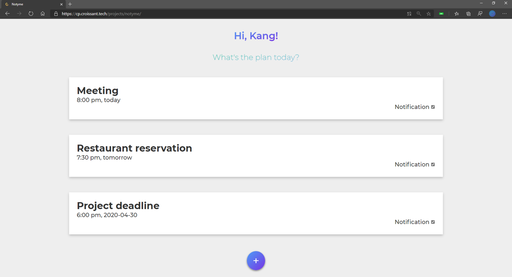
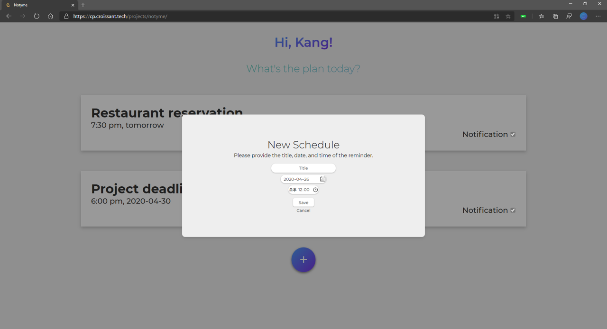
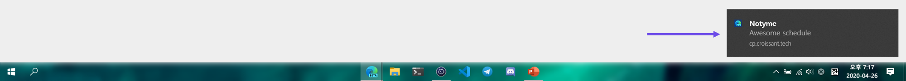

# Notyme

> To-Do and schedule notification? Notyme!

https://cp.croissant.tech/projects/notyme/

## Features

- View and adjust saved schedules at a glance.
  - Manage schedules easier through intuitive expressions such as 'Today' and 'Tomorrow'.
  - If you do not want to be notified, you can drag the notification to the checkbox.
  - The schedule is automatically sorted, and the schedule for the past hour is deleted.

- Register your schedule.
  - If you try to register multiple schedules at the same time, Notyme will stop you.
  - You cannot register past dates.
  

- You can delete a schedule.

- If the notification of the set schedule is turned on, Notyme will send the notification of the schedule.
  - The page must be turned on.
